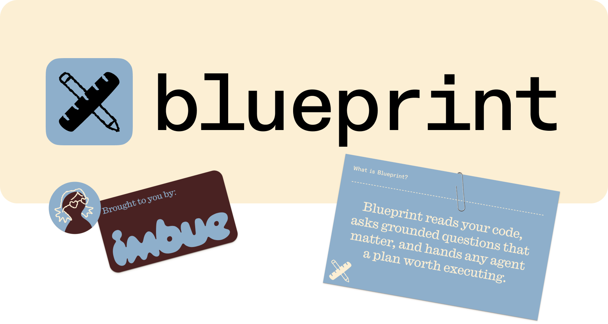

<p align="center">
  <a href="https://imbue.com/blueprint">
    
  </a>
</p>

# Blueprint

Planning copilot for coding agents. Blueprint asks the right questions before you write code, then hands your agent a plan it can execute in one shot.

Agent-agnostic skills compatible with [skills.sh](https://skills.sh). Works with Claude Code, Codex CLI, Gemini CLI, Pi agent, and other compatible harnesses.

## Why Blueprint

Most coding agents rush to code or guess at the plan. Blueprint slows down just enough to ask the right questions. It reads your codebase and asks multiple-choice questions you can answer easily. It catches things you didn't think to think about. The output is a markdown plan any coding agent can execute.

> "Catches things that I didn't think to think about."
>
> "A way to get ideas out of your mind and into a spec."
>
> "I'm never going back to not using it again."

## Install

```bash
npx skills add imbue-ai/blueprint
```

## Quickstart

In your agent, invoke the skill with a short description of the task.

```text
/blueprint Add a caching layer to reduce API calls
```

Blueprint asks you to pick a template, explores your codebase, and starts asking questions. Answer what matters. Skip what you don't care about. When you have covered enough ground, generate the plan.

```text
/blueprint-generate
```

The plan is written to `blueprint/<slug>/plan-<slug>.md`. From there, chat to refine, ask *"what are the open questions?"* to surface gaps, or hand the file to your coding agent.

## Skills

| Skill                     | Description                          |
| ------------------------- | ------------------------------------ |
| `blueprint <description>` | Start a new plan session with Q&A    |
| `blueprint-generate`      | End Q&A and write the plan           |

## Workflow

1. Run `blueprint <description>`. Pick a template. The agent explores your codebase and asks the first round of questions.
2. Answer questions. Follow-ups come naturally based on your answers.
3. Run `blueprint-generate`. The plan lands at `blueprint/<slug>/plan-<slug>.md`.
4. Refine in chat. Ask *"what are the open questions?"* to surface what is still ambiguous.
5. Continue refining for as many rounds as you want.
6. Hand the plan to your coding agent.

## Templates

Two built-in templates ship by default.

- **Default.** Overview, Expected behavior, Implementation plan, Implementation phases, Testing strategy, Open questions.
- **Concise.** Overview, Expected behavior, Changes.

You can also describe a custom template inline when prompted.

### Adding a template persistently

Edit `templates.json` in both `blueprint/references/` and `blueprint-generate/references/` so the two skills stay in sync. Each entry has three fields.

- `name`. Short label shown during template selection.
- `description`. One-line summary shown next to the name.
- `prompt`. String or array of strings describing the plan structure the agent should follow.

Example:

```json
{
  "name": "feature",
  "description": "Plan for a user-facing feature",
  "prompt": [
    "The plan should contain the following sections in order.",
    "",
    "- Overview: motivation for the feature and what users will be able to do",
    "- User experience: walkthrough of the primary flow and key edge cases",
    "- Implementation: files, modules, and data types to add or change, and what each does",
    "- Testing: how to verify the feature, including unit tests, integration tests, and edge cases",
    "- Open questions: unresolved design decisions or trade-offs"
  ]
}
```

## When to use it

**Best fit.** Greenfield projects. Large new features on existing codebases. Incremental changes big enough to warrant a plan. Research experiments. New models, systems, or subsystems.

**Less ideal.** Frontends where most decisions are visual. Small refactors. Debug-polish work.

## Requirements

- A compatible agent harness (Claude Code, Codex CLI, Gemini CLI, Pi agent, etc.)
- A workspace the agent can read
- `npx` to run the install command

## How Blueprint compares

**Claude Code plan mode.** Optimized to unblock the agent. Questions are brief. Blueprint asks questions to understand *you*, not to unblock itself.

**Spec-kit, open-spec, other spec generators.** The agent makes its own choices, then asks you to review a long spec. Blueprint reverses that order. Your input comes first.

## Also available

Prefer a sidebar? Blueprint ships as a VS Code extension that works in VS Code, Cursor, and Windsurf.

## Community

Follow along with what we are building.

- [@Imbue_AI on X](https://x.com/imbue_ai)
- [Subscribe to our newsletter](https://tryimbue.link/get-email-updates)
- [Read the blog](https://imbue.com/blog)


## Related reading

- [Introducing Blueprint](https://imbue.com/product/blueprint/)

## Contributors

- [Nayana Bannur](https://github.com/NayanaBannur)
- [Nikos Plugachev](https://github.com/Nikos1001)
